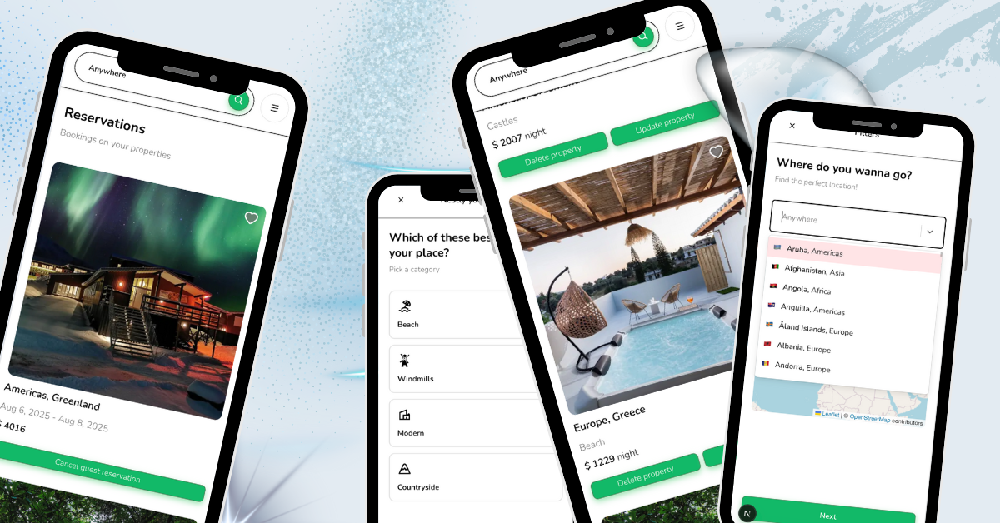
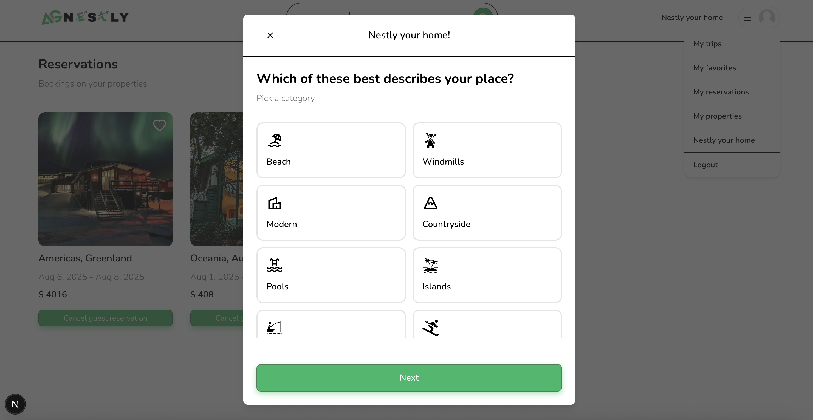
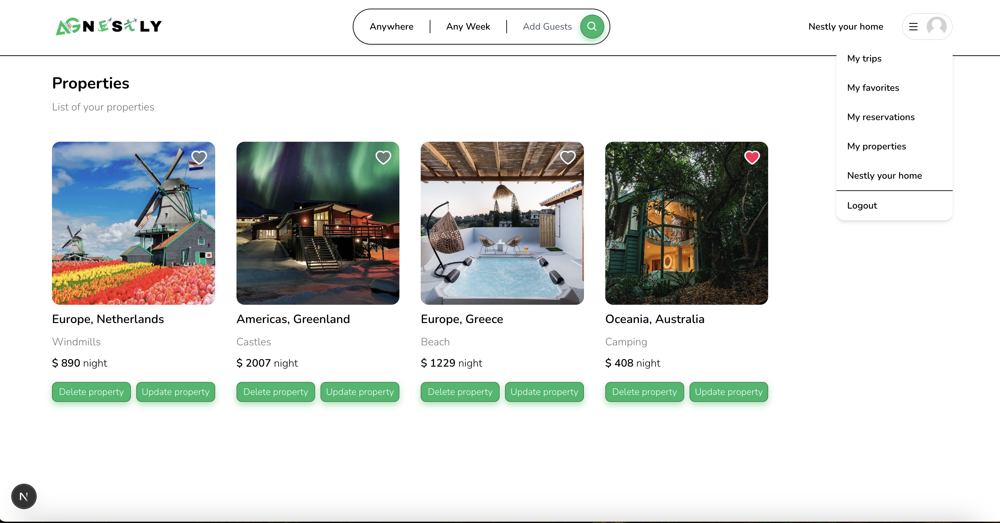

# AG-Nestly

AG-Nestly is a property rental application, built with **Next.js**, **Prisma**, **MongoDB**, **NextAuth**, and **Cloudinary**.

---



## Features

- List and search properties
- Sign up and log in with Google and GitHub
- Upload property images via Cloudinary
- Secure session and password management using NextAuth
- Responsive design for mobile and desktop


## Getting Started

**Clone the repository**
   - To clone the project, open your terminal and run the following command:
     ```bash
     git clone https://github.com/AngelaGrozdanova/AG-Nestly.git
     ```
     
**Start the App**

 - Install dependencies:
     ```bash
     npm install
     ```
   - Start the application:
     ```bash
     npm run dev
     ```
   - This will start the app and open it in your browser at [http://localhost:3000](http://localhost:3000).

## Configure Environment Variables

-- Create a .env file in the root directory:

- DATABASE_URL="mongodb+srv://<username>:<password>@cluster.mongodb.net/airbnb?retryWrites=true&w=majority"
- NEXTAUTH_SECRET="your_nextauth_secret"
- GITHUB_ID="your_github_id"
- GITHUB_SECRET="your_github_secret"
- GOOGLE_CLIENT_ID="your_google_client_id"
- GOOGLE_CLIENT_SECRET="your_google_client_secret"
- NEXT_PUBLIC_CLOUDINARY_CLOUD_NAME="your_cloud_name"


## 🛠 Tech Stack

- Frontend: Next.js, React, Tailwind CSS
- Backend: Next.js API Routes, Prisma ORM
- Database: MongoDB
- Authentication: NextAuth.js
- File Uploads: Cloudinary


--


---


--
